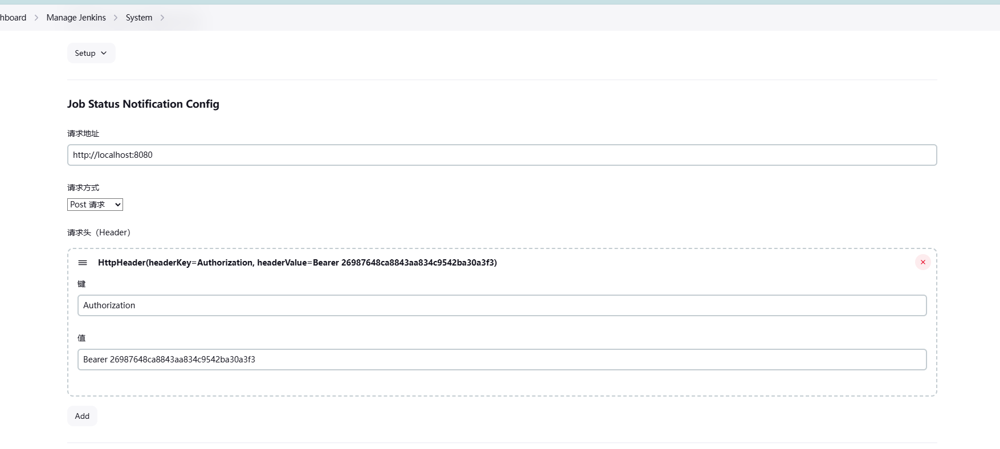

# Job Status Notification

## Introduction

The plugin provides a seamless integration solution for developers from other platforms to monitor and interact with Jenkins pipelines. It allows external systems to easily retrieve pipeline task execution statuses, access environment variables related to pipeline runs, and send custom information during the pipeline execution process.

By leveraging this plugin, platform developers can enhance their CI/CD processes with minimal configuration. Users simply need to add the request URL and relevant information in the Jenkins system configuration, and the plugin will handle the communication between Jenkins and external platforms.

The core functionalities of this plugin include:

+ **Pipeline Task Execution Status:**  Sends the status of pipeline tasks in real-time to an external platform, enabling enhanced monitoring and decision-making.
+ **Pipeline Environment Variables:**  Exposes key environment variables during pipeline execution to allow integration with external tools and systems.

By simplifying the setup process and reducing manual effort, this plugin enhances the flexibility and capabilities of Jenkins pipelines, making it easier for external systems to track and respond to pipeline events without needing to directly manipulate Jenkins jobs.
## Getting started
### System Config

To begin using the plugin and integrating your external system with Jenkins pipelines, follow these steps:

1. **Navigate to Jenkins System Configuration**
   Go to **Manage Jenkins** > **Configure System**.
   Scroll down to the section for **Job Status Notification Config**.
2. **Configure the Request Information**
   You'll need to provide the following details:

+ Request URL:
  + Enter the endpoint where the plugin should send pipeline execution data. This could be a REST API or another system endpoint designed to receive updates from Jenkins pipelines. 
  + Example: http://api.example.com/pipeline/status
+ Request Method:

  + Select the HTTP method that the plugin will use to communicate with your external system.
  + Available options:
      + GET – Retrieve data.
      + POST – Send data to the external system (most common).
      + PUT – Update existing data on the external system.
      + DELETE – Remove data on the external system.
  + Choose the method that best suits your API or integration requirement.
+ Headers (Optional):

    + If the external system requires specific headers for authentication (e.g., API tokens) or other metadata, add the required headers here.
    + To add a header:
        + Enter the Header Key (e.g., Authorization).
        + Enter the Header Value (e.g., Bearer YOUR_API_TOKEN).
3. **Save the Configuration**
   After filling out the request URL, method, and headers, click Save at the bottom of the page.
4. **Plugin in Action**
   During the execution of a Jenkins pipeline, the plugin will automatically send real-time status updates and environment variables to the configured endpoint.
   The system will use the provided HTTP method and include the specified headers in each request.
### Sending Notifications
   
   To send notifications during pipeline execution, simply include the required information in the body of the request. The plugin will handle the rest and send the data to the configured endpoint.

+ **Body Content**: The information you want to send, such as pipeline status, task details, or custom data.
+ The request will automatically use the configured **URL**, **method**, and **headers**.
No complex setup required—just add your information to the body and the plugin will send it as part of the notification!

## LICENSE

Licensed under MIT, see [LICENSE](LICENSE.md)

